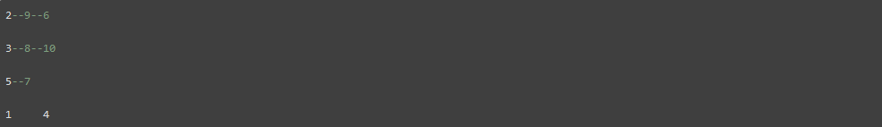
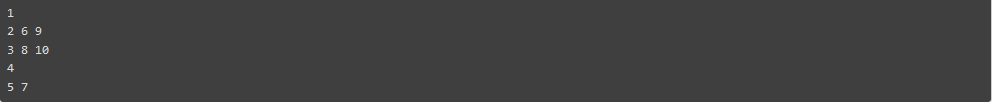
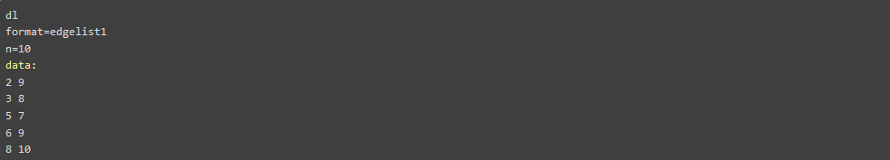

## **Universidade Federal do Ceará** | **Departamento de Computação**
### **Disciplina: Algoritmos em Grafos - CK226** | **Professor:  Pablo Mayckon Silva Farias**

#### Trabalho 1 - Componentes Conexas

Escreva um programa que receba um grafo não-direcionado e que escreva as suas componentes conexas. Uma componente conexa é um conjunto maximal de vértices ligados por caminhos no grafo. Assim, por exemplo, se a entrada for (no formato explicado adiante) o grafo

então a saída, conforme o formato explicado adiante, deve ser

##### Formato da Entrada

A entrada, recebida através da entrada padrão, estará no formato UCINET DL, lista de arestas ("edgelist1"), sem rótulos para os vértices e sem pesos para as arestas, conforme o seguinte exemplo, que é uma representação para o grafo acima:

Observe que, no formato acima, os vértices são numerados a partir de 1.

##### Formato da Saída

A saída, fornecida através da saída padrão, tem que estar no formato ilustrado pelo seguinte exemplo, que é a saída esperada para a entrada acima:

Mais precisamente:

1. Deve ser impressa uma componente conexa por linha.
2. Em cada linha, os vértices devem aparecer em ordem crescente, separados por um espaço em branco, mas sem um espaço em branco após o último vértice.
3. A primeira linha deve ser a da componente conexa do vértice 1. A segunda linha deve ser a da componente conexa do vértice 2, exceto se ele já tiver aparecido na componente conexa do vértice 1, e assim sucessivamente, ou seja: cada uma das outras linhas contém os vértices da componente conexa do vértice de menor rótulo que não tenha aparecido nas componentes listadas em linhas anteriores.

###### *Importante*:

1. A saída não precisa ser escrita toda de uma vez, ou seja, você pode gerar a saída em partes. O que importa é que a saída gerada pela execução do seu programa, se considerada como um todo, esteja no formato indicado acima.

2. Veja o arquivo `exemplos.zip` e as orientações enviadas pelo SIGAA sobre como usar as instâncias e soluções presentes nesse arquivo para testar o seu código.
